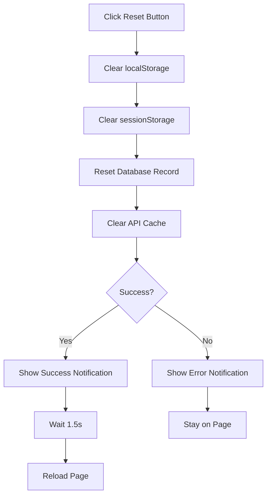

# 🔄 Development Reset Guide

## ✅ **Onboarding Reset Functionality**

The development environment now includes a comprehensive reset system for testing the onboarding flow. Here's how it works:

### 🎯 **Reset Button Location**

In development mode, you'll see a red "Reset Onboarding" button in the top-right corner of the screen.

### 🔧 **What the Reset Button Does**

#### **1. Clears Local Storage**
```typescript
localStorage.removeItem(`onboarding_completed_${user.id}`);
```

#### **2. Clears Session Storage**
```typescript
sessionStorage.removeItem(`onboarding_completed_${user.id}`);
```

#### **3. Resets Database Record**
```typescript
// Updates the user record in Supabase
{
  onboarding_completed: false,
  onboarding_completed_at: null,
  terms_accepted: false,
  terms_accepted_at: null,
  updated_at: new Date().toISOString()
}
```

#### **4. Clears API Cache**
```typescript
// Clears the onboarding status cache
clearOnboardingCache(userId);
```

#### **5. Shows Success Notification**
- **Success**: Green notification confirming reset
- **Error**: Red notification with error details

#### **6. Reloads Page**
- **Success**: 1.5-second delay to show notification, then reload
- **Error**: No reload, user can try again

### 🚀 **How to Use**

#### **Step 1: Complete Onboarding**
1. Fill out the onboarding form
2. Submit successfully
3. Verify onboarding screen disappears

#### **Step 2: Reset for Testing**
1. Click the red "Reset Onboarding" button
2. Wait for success notification
3. Page will reload automatically
4. Onboarding screen should appear again

#### **Step 3: Test Again**
1. Complete onboarding again
2. Verify it works correctly
3. Repeat as needed for testing

### 🔍 **Debug Information**

#### **Console Logs**
The reset process provides detailed console logs:

```typescript
🔄 Development: Resetting onboarding for user: [userId]
🔄 Resetting onboarding status for user: [userId]
✅ Onboarding status reset successfully for user: [userId]
✅ Onboarding reset successfully
```

#### **Error Handling**
If something goes wrong, you'll see:

```typescript
❌ Failed to reset onboarding: [error message]
❌ Error resetting onboarding: [error details]
```

### 🛡️ **Safety Features**

#### **Development Only**
- Reset button only appears when `NODE_ENV === 'development'`
- Won't appear in production builds
- Safe for testing without affecting production data

#### **User Confirmation**
- Success notification shows before page reload
- Error notifications provide clear feedback
- No accidental resets

#### **Database Safety**
- Only resets onboarding-related fields
- Preserves other user data
- Uses proper error handling

### 📱 **Notification Types**

#### **Success Notification**
- **Icon**: 🔄
- **Color**: Green
- **Message**: "Onboarding has been reset successfully! Page will reload."
- **Duration**: 1.5 seconds before reload

#### **Error Notifications**
- **Icon**: ❌
- **Color**: Red
- **Types**:
  - Database update failures
  - Network errors
  - General errors

### 🔄 **Reset Process Flow**



### 🎯 **Testing Scenarios**

#### **Complete Flow Testing**
1. **New User**: Complete onboarding from start to finish
2. **Reset**: Use reset button to clear everything
3. **Repeat**: Complete onboarding again
4. **Verify**: Ensure no issues with repeated completions

#### **Error Testing**
1. **Network Issues**: Test with poor connection
2. **Database Errors**: Test with invalid user ID
3. **Cache Issues**: Test with corrupted cache

#### **Edge Cases**
1. **Partial Completion**: Reset during form filling
2. **Multiple Resets**: Reset multiple times quickly
3. **Page Refresh**: Reset then refresh before reload

### 🔧 **Technical Implementation**

#### **API Function**
```typescript
export const resetOnboardingStatus = async (userId: number): Promise<{ success: boolean; error?: string }> => {
  // Reset database record
  // Clear cache
  // Return success/error status
};
```

#### **Button Component**
```typescript
{process.env.NODE_ENV === 'development' && (
  <button onClick={async () => {
    // Clear storage
    // Reset database
    // Show notifications
    // Reload page
  }}>
    Reset Onboarding
  </button>
)}
```

### ✅ **Verification Checklist**

After implementing the reset functionality, verify:

- [x] Reset button appears only in development
- [x] Clicking reset clears all storage
- [x] Database record is properly reset
- [x] Success notification appears
- [x] Page reloads after success
- [x] Error notifications work properly
- [x] Onboarding screen appears after reset
- [x] Can complete onboarding again
- [x] No issues with repeated resets

### 🎉 **Benefits**

#### **Efficient Testing**
- **Quick reset** without manual database changes
- **Visual feedback** through notifications
- **Automatic reload** for immediate testing

#### **Safe Development**
- **Development-only** functionality
- **Preserves user data** (only resets onboarding fields)
- **Proper error handling** with clear feedback

#### **Professional Experience**
- **Smooth notifications** instead of alerts
- **Consistent design** with app theme
- **Clear user feedback** for all actions

The development reset functionality makes testing the onboarding system much more efficient and professional! 🚀 